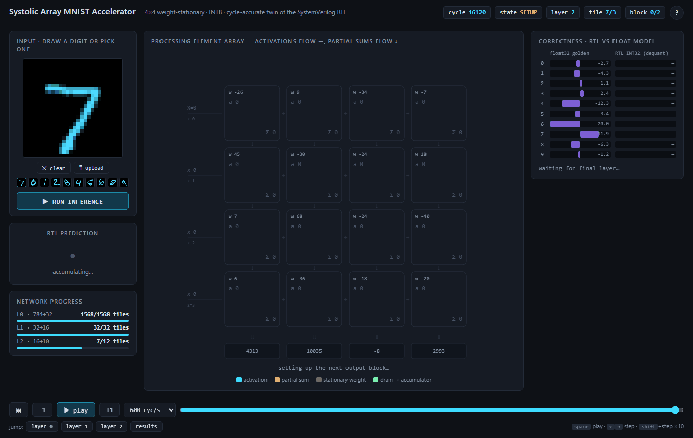
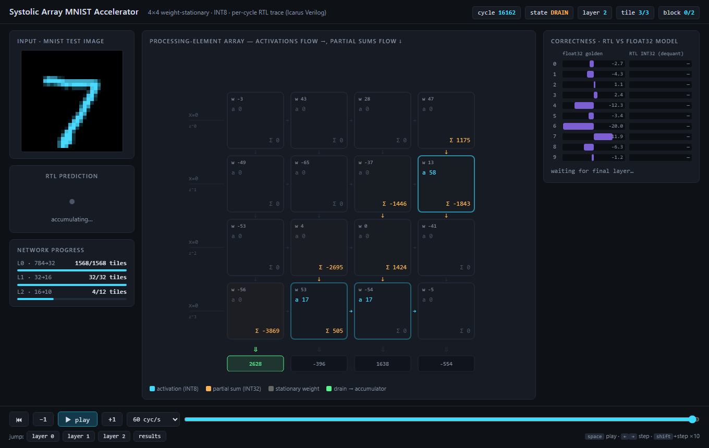
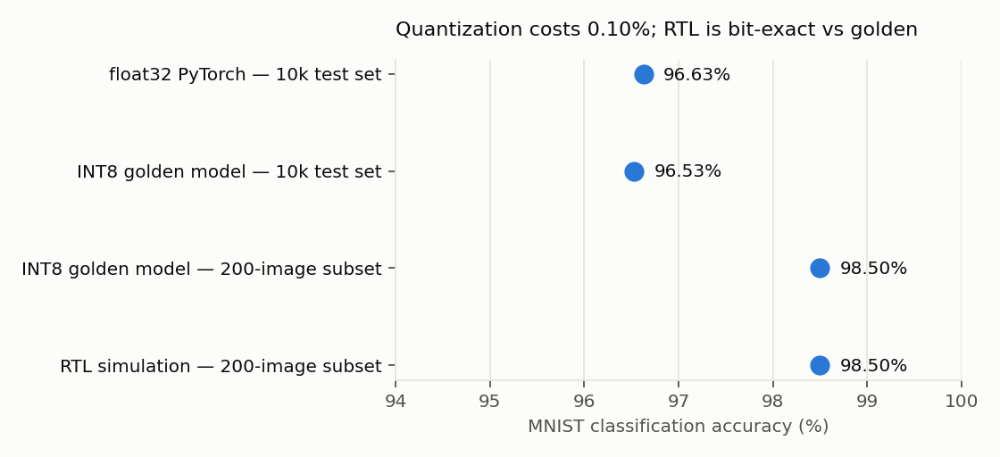
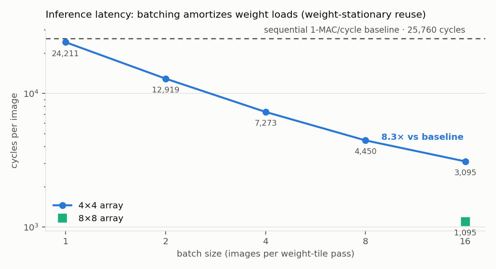

# systolic-mnist: a weight-stationary systolic-array DNN accelerator in SystemVerilog

An INT8 systolic-array accelerator that runs **real MNIST inference end-to-end
in RTL** — every multiply, bias, requantization, and ReLU of a 3-layer MLP
executes in simulated hardware — verified bit-exact against a Python golden
model, animated cycle-by-cycle in a browser, and taken through synthesis +
place-and-route timing.



> **Resume bullet (adapt freely):** *Designed and verified a parameterized
> weight-stationary systolic-array accelerator (SystemVerilog) executing full
> INT8 MNIST inference; achieved 96.5% accuracy (−0.1% vs float32 baseline)
> with bit-exact RTL/golden-model agreement across 11,600 checked values,
> 100% functional coverage (19/19 bins), 8.3× cycle-count speedup over a
> sequential-MAC baseline at batch 16, and 43 MHz Fmax / 5.4k LUTs on an
> ECP5-85k via Yosys + nextpnr.*

## Highlights

| | |
|---|---|
| **Architecture** | 4×4 (parameterized, also run at 8×8) weight-stationary PE array, skewed activation streaming, per-column INT32 accumulators, integer requantization, tiled schedule for arbitrary layer sizes |
| **Accuracy** | float32 96.63% → INT8 96.53% (10k images); RTL = golden model exactly (200/200 predictions, 2,000 logits, 9,600 hidden activations, zero mismatches) |
| **Performance** | 3,095 cycles/image @ batch 16 (**8.3×** vs 25,760-cycle 1-MAC/cycle sequential baseline); 1,095 cycles/image (**23.5×**) on the same RTL parameterized to 8×8 |
| **Verification** | self-checking TB vs executable golden spec, 3-level bit-exact checks, 19/19 functional coverage bins incl. stress corners, X-checks + protocol assertions |
| **Implementation** | 10.9k gates (generic synth); ECP5-85k P&R: **43.2 MHz**, 5,412 LUTs, 30 DSPs, 16 BRAMs |
| **Demo** | zero-dependency browser visualizer replaying the actual per-cycle RTL trace — open [`viz/index.html`](viz/index.html) |

## Why a systolic array

A dense layer `y = Wx` is a sea of multiply-accumulates with heavy operand
reuse. A systolic array exploits that reuse *spatially*: weights sit still
(one per PE), activations flow east, partial sums flow south, and every PE
does one MAC per cycle with only nearest-neighbor communication — no shared
buses, no register-file bandwidth wall. This is the dataflow of Google's TPU
family. An N×N array retires N² MACs/cycle; the same computation on a
single-MAC datapath takes one cycle per multiply.

```
            x[0]──▶ PE00 ─▶ PE01 ─▶ PE02 ─▶ PE03        activations flow east
       x[1]──────▶ PE10 ─▶ PE11 ─▶ PE12 ─▶ PE13        (skewed 1 cycle/row)
  x[2]───────────▶ PE20 ─▶ PE21 ─▶ PE22 ─▶ PE23
x[3]─────────────▶ PE30 ─▶ PE31 ─▶ PE32 ─▶ PE33
                    │       │       │       │            partial sums flow south
                    ▼       ▼       ▼       ▼
                  acc0    acc1    acc2    acc3           per-column INT32 accumulators
```

The input skew is what makes the animation's diagonal "wave": row *r* enters
*r* cycles late so each column's cascading partial sum meets the right
activation at the right cycle. Column *c*'s dot product emerges from the
bottom N+c cycles after its vector enters.



## What's actually running

1. **Model** ([model/](model)): PyTorch trains a 784→32→16→10 MLP
   (dimensions chosen to tile cleanly into N×N blocks). Post-training
   symmetric INT8 quantization with gemmlowp/TFLite-style integer
   requantization — `clamp((acc·M + 2^(s−1)) >> s, 0, 127)` with ReLU folded
   into the clamp. [docs/quantization.md](docs/quantization.md)
2. **RTL** ([rtl/](rtl)): the array plus everything around it — packed
   weight/bias memories read with a single incrementing pointer, ping-pong
   N-way-interleaved activation banks, per-column accumulator banks with
   bias injection, requantize units, and the tiling controller FSM that
   decomposes each layer into output-block × input-tile passes (layer 0
   alone is 1,568 4×4 tile passes). [docs/architecture.md](docs/architecture.md)
3. **Verification** ([tb/](tb), [sim/](sim)): `sim/run_sim.py` generates
   bit-exact expected values from the golden model, compiles with Icarus
   Verilog, and checks *every* hidden activation and logit — not just
   predictions. Three real bugs were caught this way (a weight-load
   off-by-one, an unsigned-concatenation sign bug in the requantizer, a
   `done`-latch race); the bug log is part of
   [docs/verification.md](docs/verification.md).
4. **Visualizer** ([viz/](viz)): the testbench dumps every PE's
   activation/weight/partial-sum every cycle (24,212 cycles for one image)
   as JSON; a dependency-free Canvas app replays it with play/pause/step,
   speed control, per-layer jumps, live logit accumulation, and an RTL-vs-
   float32 comparison panel. It renders the *actual* simulation, not a
   cartoon of it.
5. **Synthesis** ([synth/](synth)): Yosys generic synthesis for
   technology-independent gate counts and logic depth, plus
   `synth_ecp5` → `nextpnr-ecp5` place-and-route on a Lattice ECP5-85k for
   real static-timing Fmax.

## Results

### Accuracy — quantization costs 0.10%, the RTL costs nothing



| Model | Test set | Accuracy |
|---|---|---|
| float32 PyTorch | 10,000 | 96.63% |
| INT8 golden model (Python) | 10,000 | 96.53% |
| RTL simulation | 200 | 98.50% — identical to golden on the same subset |

RTL vs golden: 200/200 predictions agree, all 2,000 INT32 logits and all
9,600 hidden activations bit-exact. The RTL *is* the quantized model.

### Latency — why systolic + batching wins



| Configuration | Cycles/image | vs sequential MAC |
|---|---|---|
| Sequential 1-MAC/cycle baseline (25,760 MACs) | 25,760 | 1.0× |
| 4×4 array, batch 1 | 24,211 | 1.06× |
| 4×4 array, batch 4 | 7,273 | 3.54× |
| 4×4 array, batch 16 | 3,095 | **8.32×** |
| 8×8 array, batch 16 | 1,095 | **23.52×** |

Batch 1 is the honest weight-stationary story: loading 16 weights to do 16
MACs means the array idles during loads, so throughput ≈ the sequential
baseline. Streaming a batch through each loaded tile amortizes the load —
utilization scales toward N²·B/(B+overhead) MACs/cycle. This
load-amortization trade-off is exactly why real weight-stationary
accelerators (TPU included) crave batch size, and why the 8×8 run at the
same batch gains another ~2.8× — more MACs retire per streamed element.

### Implementation cost

| Module | Cells (generic synth) | Logic depth |
|---|---|---|
| 1 PE (INT8 MAC + regs) | 901 | 63 |
| 4×4 array (16 PEs) | 8,682 | 75 |
| 8×8 array (64 PEs) | 47,316 | 144 |
| Full accelerator (4×4) | 10,858 | 166 |

Array area scales ≈ linearly in PE count (~543 cells/PE at 4×4 amortized,
~739 at 8×8 including wider drain adders) while MACs/cycle scale as N² —
the core efficiency argument for scaling the array. The full-top depth of
166 is dominated by the unpipelined requantize multiply, which is also the
ECP5 critical path.

**ECP5-85k place-and-route (Yosys + nextpnr):** 43.2 MHz Fmax, 5,412 LUTs
(6%), 3,109 FFs, 30 DSP multipliers, 16 block RAMs, closed with real static
timing analysis. At 43 MHz / 3,095 cycles ≈ **72 µs per digit** (14k
images/s) at batch 16. Obvious next timing step: pipeline the requantize
multiply and register the accumulator read-modify-write, which decouples
the two longest paths.

## Functional coverage

19/19 bins (100%) across the regression list: weight sign/extremes/zero,
activation zero/mid/max, requantizer ReLU-clamp/mid/saturate, accumulator
magnitude decades, partial-sum signs, and batch-size corners. Saturation
bins are unreachable with calibrated real data by design — a stress run with
synthetic corner images (all-127, checkerboard, ramp) closes them, which is
what stress runs are for. Details: [docs/verification.md](docs/verification.md).

## Repository layout

```
model/   PyTorch training, INT8 quantization, bit-exact golden model, exports
rtl/     synthesizable SystemVerilog (pe, array, skew, acc banks, requant, top)
tb/      self-checking testbenches (full-system + array smoke test)
sim/     run_sim.py harness, weight packer/config generator, traces
synth/   Yosys + nextpnr flows, synthesis wrappers
viz/     browser visualizer + trace packager + screenshot/GIF capture
docs/    architecture, quantization, verification write-ups + images
results/ regression JSON, plots, generated summary
```

## Reproducing everything

```bash
pip install -r model/requirements.txt          # torch, torchvision, numpy
# OSS CAD Suite (Icarus Verilog + Yosys + nextpnr) on PATH: bin/ and lib/

python model/train.py --epochs 15              # 96.63% float32
python model/quantize.py                       # 96.53% INT8 + hex exports
python sim/run_sim.py --images 200 --batch 16  # main RTL regression
python sim/run_sim.py --stress --batch 1       # coverage corners
python sim/run_sim.py --images 200 --batch 16 --n 8   # 8x8 array
python sim/run_sim.py --images 1 --batch 1 --trace sim/traces/img0.json
python viz/build_demo.py                       # package trace for the viz
start viz/index.html                           # the demo
python synth/run_synth.py                      # gate counts + ECP5 timing
python results/make_plots.py                   # plots + summary tables
```

## Honest limitations / next steps

- **Weight loads are not overlapped with compute.** Double-buffered weight
  registers (load tile *i+1* while computing tile *i*) would hide the
  (N+1)-cycle load entirely — the single highest-leverage performance fix.
- **Requantize is combinational** (32×16 multiply): the Fmax critical path.
  One pipeline stage ≈ free throughput.
- **Batch=1 latency is bus-limited by design honesty**, not a bug — see the
  utilization discussion above.
- The testbench loads images through a simple port (784 cycles/image);
  a real system would DMA. Cycle counts above exclude image load, matching
  how accelerator papers report compute latency.
