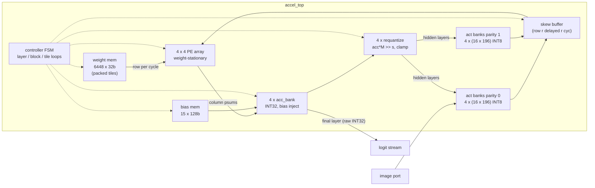

# Accelerator architecture

A weight-stationary systolic array executing a quantized 784→32→16→10 MLP
end-to-end in hardware: all three matrix multiplies, bias handling,
requantization, and ReLU. The testbench only loads pixels and reads logits.

## Top level



## The PE array

Each PE holds one INT8 weight and performs one INT8×INT8 MAC per cycle into
the INT32 partial sum flowing through it:

```
            x[0]──▶ PE00 ─▶ PE01 ─▶ PE02 ─▶ PE03        activations flow east
       x[1]──────▶ PE10 ─▶ PE11 ─▶ PE12 ─▶ PE13        (skewed by 1 cycle/row)
  x[2]───────────▶ PE20 ─▶ PE21 ─▶ PE22 ─▶ PE23
x[3]─────────────▶ PE30 ─▶ PE31 ─▶ PE32 ─▶ PE33
                    │       │       │       │            partial sums flow south
                    ▼       ▼       ▼       ▼
                  acc0    acc1    acc2    acc3           per-column accumulators
```

PE(r,c) holds `W[out = c][in = r]`: **column c owns output neuron c** of the
current 4×4 tile. A full column sum takes N cycles to cascade down, so column
c's result for a vector emerges `N + c` cycles after that vector's first
element enters the west edge — outputs are naturally skewed, and the
controller's per-column valid pipelines account for it.

Weights load through a separate port, one row per cycle (N+1 cycles per tile
including the synchronous-read address lead). Because the weight memory is
packed offline in exactly the loop order the controller executes
(layer → output block → input tile → row), the address generator is a single
incrementing pointer.

### Double-buffered weights and the swap token

Each PE holds two weight registers: loads write the **shadow** register while
the MAC uses the **active** one, so tile *i+1*'s weights stream into the
array underneath tile *i*'s computation. The handover is a 1-bit **swap
token** injected at the west edge through the same per-row skew as the
activations: it sweeps the array on the data wavefront, and each PE promotes
shadow → active exactly as the token passes. Since the token moves like a
data element, the next tile's first vector can follow **one cycle behind
it** — switching weight tiles costs a single pipeline slot instead of a full
load-drain serialization. The only ordering constraint is that a shadow row
must not be rewritten before the previous token has swept that row, which
the controller guarantees by starting the underlying load N slots into each
tile's stream.

## Tiling: mapping a 784×32 matmul onto a 4×4 array

Real accelerators are always much smaller than the workload; the schedule
below is the standard output-block / reduction-tile decomposition:

```
for layer  l in 0..2:                     # 784x32, 32x16, 16x10(pad 12)
  for output block j in 0..out/4-1:      # 4 output neurons at a time
    preload tile 0 into shadow regs      # N+1 cycles, once per block
    for input tile i in 0..in/4-1:       # reduce over input in chunks of 4
      issue swap token                   # 1 slot: shadow -> active on the wavefront
      stream B activation vectors        # B slots; tile i+1's shadow loads
                                         #   underneath from slot N
      accumulate column psums            # acc[c][b] += psum (bias on i==0,
                                         #   flag piped with the drain valids)
    drain tail, then requantize          # or raw INT32 logits (last layer)
```

Layer 0 is 196 input tiles × 8 output blocks = 1568 tile passes; layers 1
and 2 add 32 + 12. Partial sums live in per-column INT32 accumulator banks
*outside* the array between tiles — the array itself stays busy with the
next tile.

## Batching and utilization (the weight-stationary trade-off)

Even with weight loads fully hidden by double buffering, each tile still
costs a swap slot plus (at small batch) the shadow-load latency floor, and
each output block pays a drain tail — so per-image cost still falls as more
images stream per tile pass. Batch = 1 leaves the array mostly waiting on
its own pipeline; at B = 16 the same weights serve B×16 MACs and per-tile
overhead is amortized 16 ways. The Results section quantifies this against
a 1-MAC/cycle sequential baseline; scaling to 8×8 quadruples MACs/cycle at
the same clock.

## Between layers: ping-pong activation banks

Activations are stored 4-way interleaved (element idx → bank idx%4, address
idx/4) so one input tile (4 consecutive elements) reads in a single cycle,
one element from each bank. Two parities of banks alternate: layer l reads
parity l%2 while its requantized outputs write parity (l+1)%2 — output block
j's element j*4+c lands in bank c at address j with no write conflicts.

## Requantization

Between layers, INT32 accumulators are rescaled to INT8 with the integer
multiplier/shift scheme documented in [quantization.md](quantization.md):
`clamp((acc*M + 2^(s-1)) >> s, 0, 127)`, ReLU folded into the low clamp.
The final layer skips this: classification is argmax over raw INT32 logits.

## Design-for-verification hooks

- Inter-PE nets (`a_h`, `psum_v`) and stored weights (`w_dbg`) are
  module-level arrays, runtime-indexable from the testbench — this is what
  makes the complete per-cycle JSON trace (and the visualizer) possible.
- `model/golden.py` defines every arithmetic operation bit-exactly; the
  testbench checks hidden-layer activations and logits against it, not just
  final predictions.
